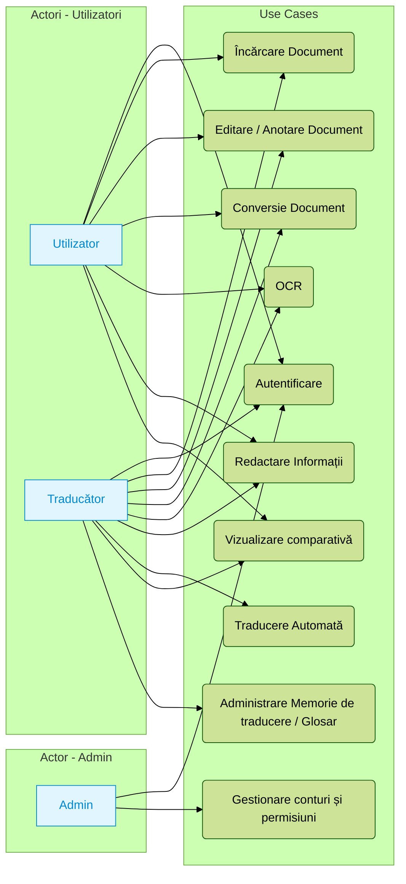
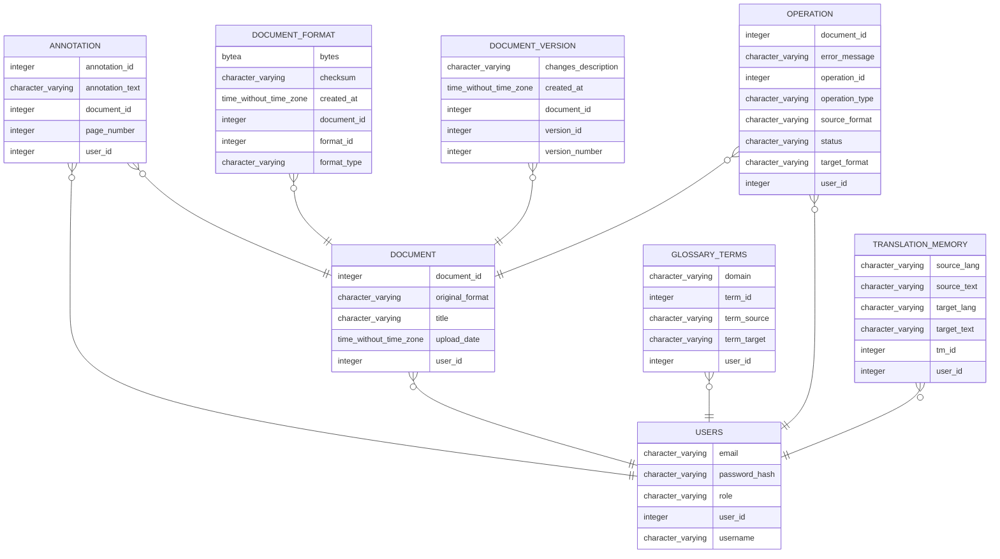

# Side-by-Side Translator Application

A comprehensive translation tool built with Electron.js, Vue.js, and C# .NET 9, designed to assist translators with document translation, redaction, annotation, and other document processing tasks.

## Features

- **Three-column Layout**: Original PDF, translation memory, and translated preview
- **PDF Processing**: View, edit, annotate, and redact PDF documents
- **OCR**: Extract text from scanned documents and images
- **Translation Memory**: Store and reuse previous translations
- **Export Options**: Generate translated documents in various formats
- **Docker Support**: Containerized services for consistent development and deployment

## Architecture

The application uses a three-tier architecture:
1. **UI Layer**: Electron.js application with Vue.js
2. **Business Logic Layer**: C# .NET 9 backend API services
3. **Data Layer**: MongoDB for persistent storage

All backend services are containerized using Docker for consistent development and deployment.

### Docker Infrastructure
```
┌─────────────────────────────────┐
│      Electron Desktop Shell     │
│         (Host Machine)          │
├─────────┬─────────┬─────────────┤
│  PDF    │   TM    │ Translated  │
│ Viewer  │ Lookup  │  Preview    │
├─────────┴─────────┴─────────────┤
│        API Communication        │
└───────────────┬─────────────────┘
                │
┌───────────────▼─────────────────┐
│        Docker Network           │
├─────────────────────────────────┤
│ ┌─────────┐  ┌───────────────┐  │
│ │  API    │  │    MongoDB    │  │
│ │Container│  │   Container   │  │
│ └─────────┘  └───────────────┘  │
│ ┌─────────┐  ┌───────────────┐  │
│ │Tesseract│  │    Redis      │  │
│ │Container│  │   Container   │  │
│ └─────────┘  └───────────────┘  │
└─────────────────────────────────┘
```

## Prerequisites

- **.NET 9 SDK and Runtime**
- **Node.js and NPM** for Electron/Vue development
- **Docker and Docker Compose** for containerized services
- **Git** for version control

## Getting Started

### Setting Up the Development Environment

1. **Clone the repository**
   ```bash
   git clone https://github.com/yourusername/SideBySide2.git
   cd SideBySide2
   ```

2. **Start the backend services with Docker**
   ```bash
   docker-compose up -d
   ```

3. **Setup the Frontend (Electron/Vue)**
   ```bash
   cd Frontend
   npm install
   npm run dev
   ```

### Project Structure

```
SideBySide2/
├── Backend/
│   └── SideBySideAPI/          # .NET 9 API project
│       ├── Controllers/        # API endpoints
│       ├── Services/           # Business logic
│       ├── Models/             # Data models
│       ├── Data/               # MongoDB context
│       └── Dockerfile          # API container definition
├── Frontend/                   # Electron.js with Vue.js
│   ├── src/                    # Vue source code
│   │   ├── components/         # Vue components
│   │   ├── views/              # Vue views
│   │   └── services/           # API integration
│   └── electron.js             # Electron main process
├── Tesseract/                  # OCR service
│   ├── ocr_processing.py       # OCR script
│   └── Dockerfile              # Tesseract container definition
├── docker-compose.yml          # Docker services config
├── .dockerignore               # Docker ignore rules
├── .gitignore                  # Git ignore rules
├── PLANNING.MD                 # Project planning document
└── TASK.md                     # Task tracking
```

## Development Workflow

1. **Check PLANNING.MD** for project architecture and vision
2. **Review TASK.md** for current tasks and priorities
3. **Use Docker Compose** to manage backend services
4. **Run the Electron app** in development mode

## Docker Services

- **API**: .NET 9 REST API service (port 5000)
- **MongoDB**: Database for translation memory (port 27017)
- **Redis**: Caching service (port 6379)
- **Tesseract**: OCR processing service

## Building and Deployment

### Building the Electron App

```bash
cd Frontend
npm run build
```

### Running Tests

```bash
# Backend tests
cd Backend/SideBySideAPI
dotnet test

# Frontend tests
cd Frontend
npm run test
```

### Creating an Installer

```bash
cd Frontend
npm run make
```

## Contributing

1. Check TASK.md for current priorities
2. Create a feature branch from the main branch
3. Implement changes and test them locally
4. Update documentation if necessary
5. Submit a pull request

## License

This project is licensed under the MIT License - see the LICENSE file for details.

### Lista de tehnologii

- **Front-end**:  
  - Framework: React / Vue / Angular (în curs de alegere, React fiind un candidat principal).  
  - Stilizare: Bootstrap 

- **Back-end**:  
  - **C# .NET (ASP.NET Core)** și/sau **TypeScript**
  - **OCR**: Integrare cu Tesseract sau servicii cloud (Azure Cognitive Services, Google Vision).  
  - **Traducere automată**: API terț (Google Translate, Azure Translate).  
  - **Conversie documente**:  
    - Librării: LibreOffice, img2pdf erc.
  - **Editare PDF**:  
    - iText 7 (C#) sau pdf-lib / PDFKit (TypeScript) pentru operațiuni de bază (anotare, semnătură, extragere text).

- **Bază de date**:  
  - SQL (Microsoft SQL Server, PostgreSQL) sau NoSQL (MongoDB), în funcție de complexitatea necesară (versiuni, stocare etc.).

- **Alte considerente**:  
  - **Autentificare**: JWT sau Identity Server (în ASP.NET Core).  
  - **Stocare fișiere**: Azure Blob, AWS S3, Google Cloud Storage.  

---

### Requirments document

| Funcționalitate                                          | Impact | Dificultate | Observații                                                                                                                                       |
|----------------------------------------------------------|--------|-------------|---------------------------------------------------------------------------------------------------------------------------------------------------|
| **Editor PDF**                                           | ⭐⭐⭐  | ⭐⭐       | Permite editarea textului, adăugarea de adnotări, reorganizarea paginilor. Necesită o bibliotecă sau API robustă de lucru cu PDF-uri.            |
| **OCR (Recunoaștere Optică a Caracterelor)**             | ⭐⭐⭐  | ⭐⭐⭐       | Foarte utilă pentru documente scanate sau imagini. Integrare cu Tesseract sau servicii cloud (Azure, Google Vision).                             |
| **Traducere automată**                                   | ⭐⭐⭐  | ⭐⭐       | Esențială pentru traducătorii care doresc să accelereze fluxul. Conectare la un API (Google Translate, Azure Translate).                         |
| **Vizualizare comparativă (Side by Side)**               | ⭐⭐  | ⭐      | Permite compararea rapidă a două documente sau a versiunii inițiale vs. cea editată.                                                             |
| **Conversie documente (imagine <-> PDF <-> DOCX)**          | ⭐⭐⭐  | ⭐⭐       | Funcție de bază pentru lucrul cu formate multiple.                         |
| **Redactare / Cenzurare (Redaction)**                    | ⭐⭐  | ⭐⭐       | Elimină definitiv datele sensibile dintr-un document.                                                |
| **Colaborare (multi-utilizator)**                        | ⭐⭐⭐  | ⭐⭐⭐       | Editare în timp real și gestionarea conflictelor.                                                              |
| **Control versiuni / Track Changes**                     | ⭐⭐⭐  | ⭐⭐⭐       | Urmărește și permite revenirea la diferite versiuni.                                              |
| **Adnotări / Markup**                                    | ⭐⭐  | ⭐⭐       | Comentarii, evidențieri, forme grafice.                                                             |
| **Semnătură electronică / Digitală**                     | ⭐⭐  | ⭐⭐       | Necesită criptografie sau integrare cu servicii de e-sign (DocuSign, Adobe Sign).                                                               |
| **Căutare avansată (Full-text, cuvânt-cheie)**           | ⭐⭐⭐  | ⭐⭐       | Facilitează lucrul cu documente mari.                                         |
| **Autentificare / Autorizare utilizatori**               | ⭐⭐⭐  | ⭐⭐       | Critică pentru securitatea documentelor; gestionare roluri (admin, translator, user simplu).                                                    |
| **Stocare în Cloud / Sincronizare**                      | ⭐⭐⭐  | ⭐⭐       | Permite accesul la documente de pe diferite dispozitive.                                                              |
| **Export adnotări / comentarii**                         | ⭐⭐  | ⭐      | Posibilitatea de a partaja feedback-ul sau notițele într-un format separat sau integrat.                                                         |
| **Memorie de traducere (Translation Memory)**            | ⭐⭐⭐  | ⭐⭐⭐       | Foarte utilă pentru traducătorii profesioniști; stochează segmentele și traducerile lor.                                                        |
| **Glosar / Terminologie specializată**                   | ⭐⭐⭐  | ⭐⭐       | Asigură consecvența pentru termeni specializați și viteză sporită în proiectele de traducere.                                                   |


#### Cerințe nefuncționale

1. **Performanță**  
   - Conversiile să dureze un timp rezonabil.  
2. **Fiabilitate și disponibilitate**  
   - Gestionarea întreruperilor fără coruperea datelor.  
3. **Scalabilitate**  
   - Suport pentru documente mari și utilizatori multipli.  
4. **Securitate**  
   - Criptare (HTTPS) și eventual criptarea la stocare (cloud).  
5. **Utilizabilitate**  
   - Interfață intuitivă, pași simpli pentru operațiile principale.

---

### User Stories

1. **Ca utilizator simplu**:  
   „Doresc să încarc un fișier PDF și să-l convertesc în DOCX pentru a-l edita ulterior.”

2. **Ca utilizator simplu**:  
   „Vreau să aplic OCR pe un fișier needitabil pentru a putea căuta și edita conținutul.”

3. **Ca utilizator**:  
   „Am nevoie să ascund informații sensibile dintr-un PDF prin redactare.”

4. **Ca traducător profesionist**:  
   „Doresc să folosesc traducerea automată pentru a majoritatea documentului, apoi să retușez manual textul.”

5. **Ca traducător profesionist**:  
   „Vreau să-mi construiesc o memorie de traducere și un glosar, pentru a asigura consistența și rapiditatea în proiectele viitoare.”

6. **Ca utilizator**:  
   „Vreau să compar rapid două versiuni ale aceluiași document, ca să văd ce s-a schimbat.”

7. **Ca admin**:  
   „Am nevoie să gestionez conturile de utilizatori, documentele și permisiunile pentru a menține politica de securitate.”
---

### 2.4. Diagrama de Use Case

- **Actori**:  
  1. **Utilizator** (standard, traducător)  
  2. **Administrator**

---

### 2.5. Diagrama ER



---
